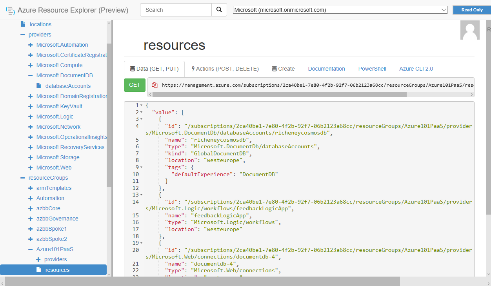

Understanding the theory behind Azure Resource Manager.




## Background

Azure Resource Manager, or ARM, is the dominant deployment type for Azure, spanning the public clouds, government clouds and Azure Stack private cloud deployments.  It superseded the Azure Service Manager which is expected to be slowly deprecated over time, and will be ignored in this lab except as a comparison point. 

## Resources, resource groups and resource providers

If you have used the ARM portal ([http://portal.azure.com](http://portal.azure.com)), then you will be familiar with deploying various resources into resource groups.  Resource groups are designed as a natural management point for related resources, based on groupings, linked lifecycle, use case, billing aggregation, role based access control, etc.

The resources themselves are provided by [resource providers](https://docs.microsoft.com/en-us/azure/azure-resource-manager/resource-group-overview#resource-providers).  Each *resource provider* will provider one or more *resource types*. To see which providers are registered (and unregistered) on your subscription, use the CLI 2.0 command below: 
```
az provider list --output table

Namespace                               RegistrationState
--------------------------------------  -------------------
Microsoft.Advisor                       Registered
Microsoft.ApiManagement                 Registered
Microsoft.Automation                    Registered
Microsoft.Cache                         Registered
Microsoft.Cdn                           Registered
Microsoft.Compute                       Registered
Microsoft.ContainerRegistry             Registered
Microsoft.ContainerService              Registered
...
``` 

Type ```az provider show --namespace Microsoft.Network``` to view the JSON detail of a resource provider.  Note 
* the ID is specific to your subscription
* each resource type has numerous API versions relecting the innovation within Azure
* will be supported in a number of named locations, or will be specified as a global service

## Resource Explorer

You can see the definitions of the resources, resource groups and resource providers in use within your subscription in the resource explorer ([http:/resources.azure.com](http:/resources.azure.com)).  

Drill into an existing resource group and select the resources within it and the unique *id* will reflect:
* the subscription id
* resource group name
* resource provider and type 
* and the resource name itself

The *type* is the resource type in the *Resource.Provider/resourceType* naming type, e.g. "Microsoft.Logic/workflows"   
    


## Azure Resource Manager JSON template format

