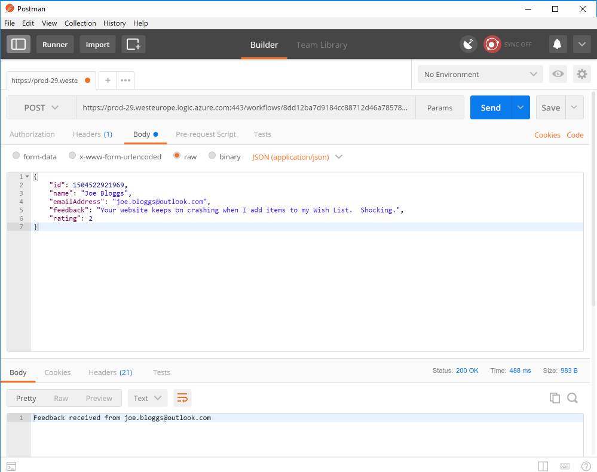

Logic App lab for the Azure 101 workshop.



## Introduction

Logic Apps are quick plug and play "if .. then ..." constructs to help developers and power users to quickly integrate systems.  They complement some of the other PaaS type offerings such as serverless Functions, or Event Grid and other event based services.

In this logic app lab we will create a quick HTTP endpoint for feedback, that could then be used by websites, mobile apps or custom applications.  The feedback could be added into a Service Bus, or added to a data area such as Table Storage.  We will be sending an email out containing the feedback information in this lab.

## Tutorial

### Deploy Cosmos DB

* Click **Add** in the Azure101PaaS resource group
* Add Azure Cosmos DB
  * ID: **yourname**
  * API: **Table (key-value)**
  * Resource Group: **Azure101PaaS**

The Cosmos DB will take a little while to fully deploy, so open up another tab and continue with the following steps.   

### JSON Payload

* Open the [example JSON payload](./feedback.json) into a new tab.  This is the format that the various applications will use for feedback into our system.
* Open the [JSON schema](./schema.json) into a new tab.  The schema describes the expected format.  This has been created using the example payload via the excellent https://jsonschema.net website. 
* Select the schema contents and copy them to the clipboard as we will use this later when defining the Logic App.

### Create the Logic App

* Click **Add** in the Azure101PaaS resource group
* Find _Logic App_ and click on **Create**
  * Name: **feedbackLogicApp**
* Click into the new Logic App once deployed
* Select **Blank Logic App** in the Logic Apps Designer screen

### Define the Logic

* Search for **Request** / Response for the trigger
  * Paste in the JSON schema
* Click on **+New Step** and then **Add an Action**
* Search for Request / **Response** for the action
  * Use the default HTTP status code of 200
  * Body: **Payload received from _Feedback: email_**
    * Enter in _Payload received from_ as text
    * Click on the _Add dynamic content_ button and select **Feedback: email** 
* Click on **+New Step** and then **Add an Action**
* Search for "_email_" and choose a platform.  The steps below are for Office 365 Outlook.
  * Click on the **Send an Email** action
  * Sign in to create the connection
  * To: **yourEmailAddress**
  * Subject: **Feedback from _Feedback: name_**
  * Body: Add in all of the useful information from the JSON payload
* Click on **Save**

An example Logic App definition is shown below.

### Test the Logic App

* Click on the breadcrumb for the Logic App itself rather than the Designer to show the Trigger History in the Overview
* Click on the copy icon on the right of the **Callback url [POST]**.  This is the HTTP REST API endpoint
* Open up the Postman app, skipping login
  * Change the action to **POST**
  * Paste the HTTP REST API into the _Enter request URL_ field
  * Leave Authorization as _No Auth_
  * Add one header:
    * Key: **Content-Type**
    * Value: **application/json**
  * Toggle the Body type to raw
  * Open the [example JSON payload](./feedback.json) we saw earlier into a new tab, and copy the contents to the clipboard 
  * Paste the JSON payload into Postman
  * Click on the blue **Send** button
  * The HTTP response from the Logic App should show in the bottom pane:

  

### Finishing up

* Go to the Overview area of the Logic App
* Check that there is a new entry in the Trigger History
* Click on the new **Runs History** entry to view the details
  * Open up the individual steps to view the inputs and outputs
* Check your inbox and verify that the feedback email has been received
* Go into the **Azure101PaaS** resource group and review the new resources that have been created 

### Adding a permanent record in Cosmos DB

* Go into the Cosmos DB resource
* Add a **Collection**
  * Table Id: **Feedback**
  * Storage Capacity: **Fixed (10GB)**
  * Initial Throughput Capacity (RU/s): **400**
* In the Cosmos DB Overvieware, copy the URI
  * URI form **https://_\<ID>_.documents.azure.com:443/**
* Go back into your Logic App and click on **Edit**
* Add a new action between Response and Send an Email
* Search on Cosmos DB and select _Create or update document_
* Paste in the URI into the **Connection Name** field
* Click on **Create**

click on the new Collection, opening the Data Explorer

-------------------------------------------------------
## Quick Navigate:
* Back up to [**Azure 101**](./azure101Index.md/#introduction) main page
  * [**Lab: **Using the portal and creating a vNet**](./azure101PortalLab.md/#introduction)
  * [**Lab: **Windows and Linux VMs**](./azure101VMLab.md/#introduction)
  * [**Lab: **Deploying to Web Apps from GitHub**](./azure101WebAppLab.md/#introduction)
  * [**Lab: **Using Logic Apps**](./azure101LogicAppLab.md/#introduction)