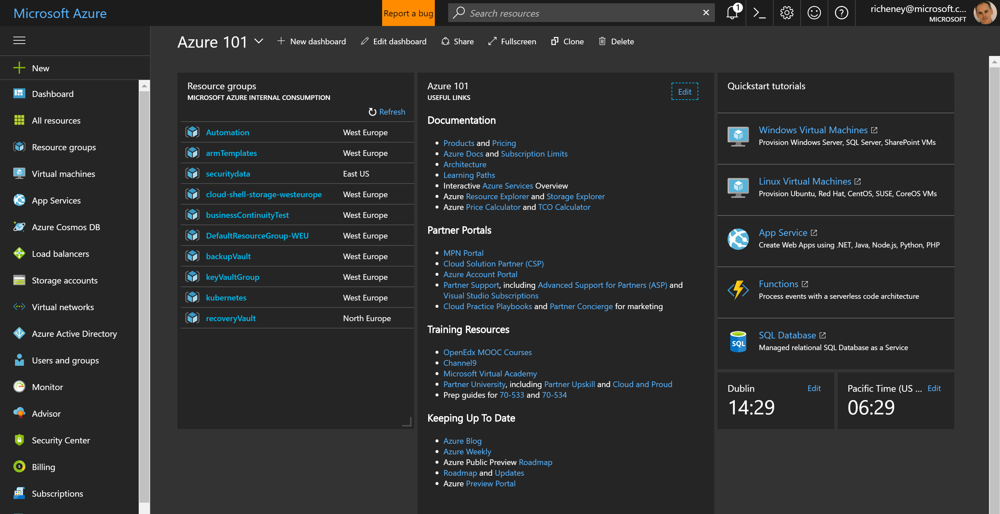

Introductory portal lab for the Azure 101 workshop. 



## Introduction

The main Azure portal is <https://portal.azure.com>.

Login using the account for your Azure subscription. Your account
information is at the top right, including password change, and viewing
permissions and your bill.  Next to that is the Help + Support, for accessing the help or opening up
a support ticket. 

Click on the Help + Support icon and then:
- launch the guided tour
- see what’s new
- check the keyboard shortcuts

Clicking on the cog icon shows the Portal Settings. You can filter
multiple subscriptions, change the language and certain portal
characteristics.
- Change the theme

Next to the Azure Cloud Shell is the _Notifications_ section, for status
updates, billing updates and to show deployment activity.

## Dashboard Customisation

The Azure portal enables you to have multiple dashboards and to
customise those dashboards. You can also share dashboards with other AAD
users or groups within the subscription, leveraging the role based
access control (RBAC) to control who has access.

- Open this [Markdown file](./portalMarkdown.txt) in a new tab and copy the contents
- Create a new dashboard in the Azure portal, and name it "Azure 101".
- From the Tile Gallery’s General area, pull across the following items:
  - **All Resources** Reconfigure (using the ellipsis (…)) to change to 4x4 tiles
  - **Clock** Reconfigure to 2x1, 24 hour, and London time
  - **Quickstart Tutorials**
  - **Markdown** Change title to "Azure 101", subtitle to Useful Links, and replace the content with the markdown you copied in the first step
- Resize and reposition tiles to fit

Once complete, your dashboard should look something like this:

## Documentation

Let’s click through some of the documentation links in the Markdown box:

-   Interactive [Azure
    Services](http://azureplatform.azurewebsites.net/en-us/) Overview
-   [Products](https://azure.microsoft.com/en-us/services) and [Pricing](https://azure.microsoft.com/en-us/pricing)
-   [Azure Docs](https://docs.microsoft.com/en-us/azure)
-   [Architecture](https://docs.microsoft.com/en-us/azure/index#pivot=architecture)
-   [Learning
    Paths](https://azure.microsoft.com/en-us/documentation/learning-paths)

------------------------------------------------------------------

## Create a resource group called Azure101IaaS

-   Open the Azure [portal](http://portal.azure.com)
-   Choose one of the following options:
    -   Click on the + New icon (or G+N), search for _Resource Group_ and click on it.
    -   Click on _Resource Groups_ in your favourites and click on **Add**
    -   Click on the _More Services_ icon, _Resource Groups_ in the General section and then on **Add**
-   Create the resource group using the following values:
    -   Resource Group Name: _Azure101IaaS_
    -   Resource Group Location: _West Europe_
-   Note the deployment notification area
-   Refresh the resource groups and click on the _Azure101IaaS_ resource group

## Create a Virtual Network (VNet) with two subnets

-   Add a Virtual Network:
    -   Click on the **+**
    -   Search on _Virtual Network_
    -   Select, then Create
-   **Name:** _azure101vNet_
-   **Address space:** _10.4.0.0/16_
-   **Subnet name:** _webSubnet_
-   **Subnet address range:** _10.4.1.0/24_

Once created, click into the VNet and add the second subnet:
-   Select subnets on the blade
-   Add _dbSubnet_ (10.4.2.0/24)

### If you have time:
If you have completed the lab early then search on information in the portal and on the Azure docs area for the following:
-   Network Security Groups (NSGs)
-   GatewaySubnet
-   ExpressRoute and Site-to-Site (S2S) VPN Gateways
-   Network Virtual Appliances
-   User Defined Routes (UDRs) in Route Tables
-   vNet Peering
-   Region to region S2S VPNs

-------------------------------------------------------
## Quick Navigate:
* Back up to [**Azure 101**](./azure101Index.md/#introduction) main page
  * [Lab: **Using the portal and creating a vNet**](./azure101PortalLab.md/#introduction)
  * [Lab: **Windows and Linux VMs**](./azure101VMLab.md/#introduction)
  * [Lab: **Deploying to Web Apps from GitHub**](./azure101WebAppLab.md/#introduction)
  * [Lab: **Using Logic Apps**](./azure101LogicAppLab.md/#introduction)