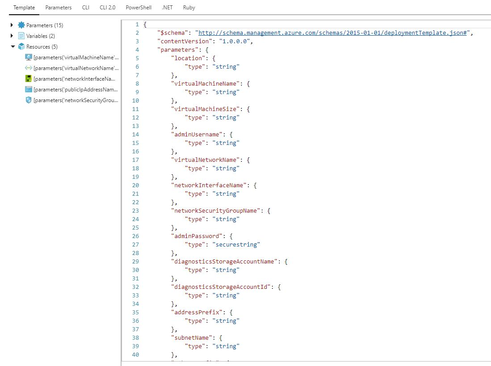

Virtual machine lab for the Azure 101 workshop.



## Introduction

This lab will create either a Windows or Linux virtual machine, but the real reason for its existence is to introduce you to the wide number of tutorials that are available for Azure.

Go to the Azure Docs area, and click on _Windows Virtual Machines_ in the Deploy Infrastructure section of the Get Started tab. Take a look at the five minute quickstarts.  There is one for the portal, for PowerShell or for CLI 2.0.  There are equivalent sets for Linux virtual machines. 

***You may now choose to create either a Windows or Linux virtual machine.  You may also choose to create it via the portal, CLI 2.0 or PowerShell.  Please read the notes below before beginning.***

Notes:
* The sections below show the parameters recommended for either Windows or Linux VMs
* If running short on time then the steps to install a web service (IIS for Windows, NGINX for Linux) should be considered optional
* The Linux portal steps below include fuller details on using an SSH key pair rather than a password
* For those using CLI 2.0 then use the bash shell in Windows 10 if you have it configured.  If not then click on the Cloud Shell icon in the portal and run the commands from within there.
* If you have followed the portal customisation lab then you will also have links to some of the quickstarts directly on your dashboard
* The 5 minute quickstarts are supplemented by additional VM tutorials available on disks, DSC, images, scale sets, load balancing, backup, monitoring, policies, etc.

--------------------------------------------------

## Info for the Windows VM quickstart

### Parameters for the Windows VM

Follow the Windows VM 5 minute quickstart and create a Windows Server 2016 Datacenter server with the following parameters:
- **Name:** _myWindowsVM_
- **VM disk type:** _SSD_
- **Resource Group:** Existing _Azure101IaaS_ resource group
- **Location:** _West Europe_
- **Size:** _DS1\_v2_
- **Use Managed Disks:** _Yes_


### If you have time:

Research the following:
- Azure Hybrid Use Benefit
- Benefits of Managed Disks vs manual storage accounts
- Deallocation vs shutdown in the remote desktop console

-----------------------------------------------------------

## Info for the Linux VM quickstart

### Create your SSH keypair

Run the following commands in your Bash shell:
```
cd ~
umask 033
ssh-keygen -t rsa -b 2048 -C "richard.cheney@microsoft.com"
ls -Al .ssh
cat .ssh/id_rsa.pub
```

The -C is a comment. It is good etiquette to add in your email address so that any key owners are easily identified. You will be prompted for a filename. You can specify an alternative name, or hit enter to use the defaults (recommended). For the passphrase, it is best practice to provide a passphrase with a few memorable but disassociated words.

However, for the sake of this exercise you may simply press enter for an empty passphrase, and then you won’t be challenged for it later when using ssh to connect to the Linux VM.

Copy the contents of the id\_rsa.pub file to the clipboard as you will
use this later.

### Parameters for the Linux VM 

Follow the Linux VM quickstart to create an Ubuntu Server 16.04 LTS server with the following parameters:
- **Name:** _myLinuxVM_
- **VM disk type:** _HDD_
- **SSH Public Key:** Copy and pasted from cat \~/.ssh/id\_rsa.pub
- **Resource Group:** Existing _Azure101IaaS_ resource group
- **Location:** _West Europe_
- **Size:** _D1\_v2_
- **Subnet:** _dbSubnet_
- **Availability Set:** Create _myLinuxAS_

*Do not* click on Create straight away. Let’s explore templates a
little.

### Templates

- Click on _Download template and parameters_. Browse the template JSON, the parameters JSON, and the scripts to deploy the template from PowerShell and CLI 2.0. 
- Click on Create to submit the job

Once the VM has been created then use the Bash shell to open a secure shell session:
- SSH to the VM’s public IP address: ssh &lt;adminuser&gt;@&lt;public IP address&gt;

### If you have time:
- Browse to the Services tab on Azure Docs, and then find the Azure Resource Manager tile in the Monitoring + Management area. Discover the [export template](https://docs.microsoft.com/en-us/azure/azure-resource-manager/resource-manager-export-template) functionality, as well as the JSON [template structure](https://docs.microsoft.com/en-us/azure/azure-resource-manager/resource-group-authoring-templates).
- Click on Add within the Azure101IaaS Resource Group, and find _Template Deployment_
- In the _Load a GitHub Quickstart_ template, type “load” and select one of the community templates and accompanying parameters file
- Search the [Azure Quickstart Templates](https://github.com/Azure/azure-quickstart-templates) GitHub repo to find the same template