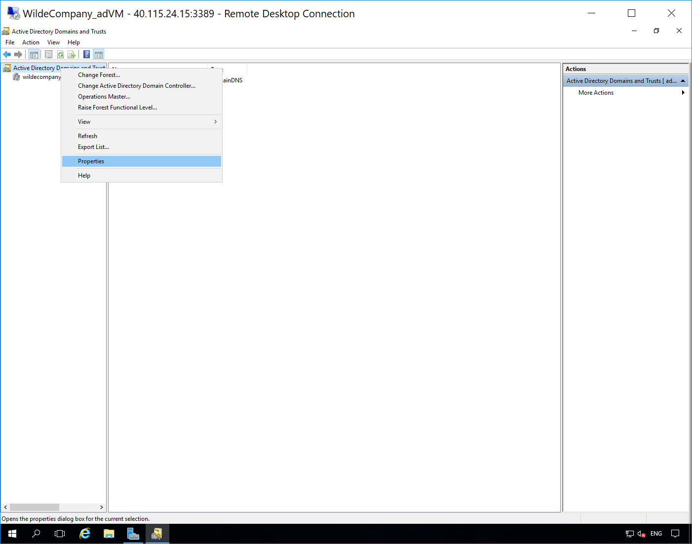
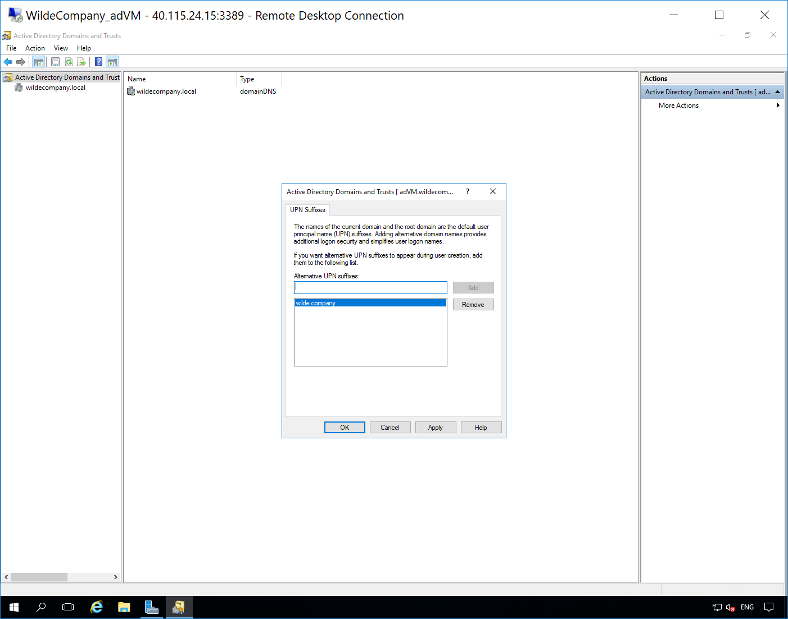
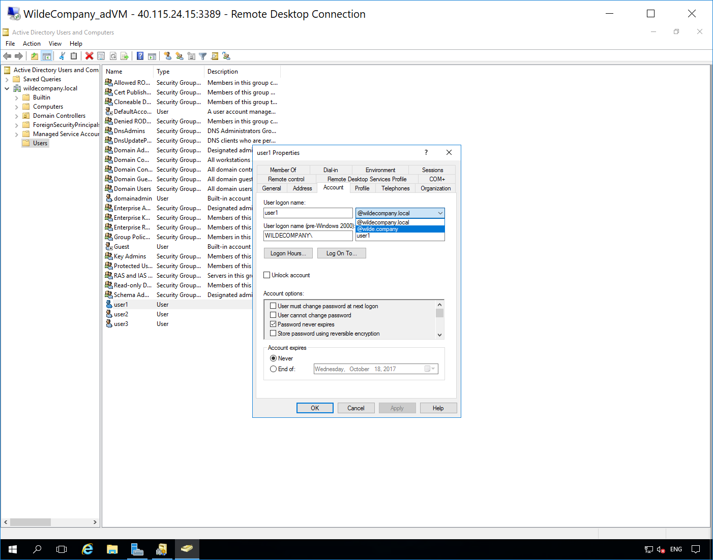
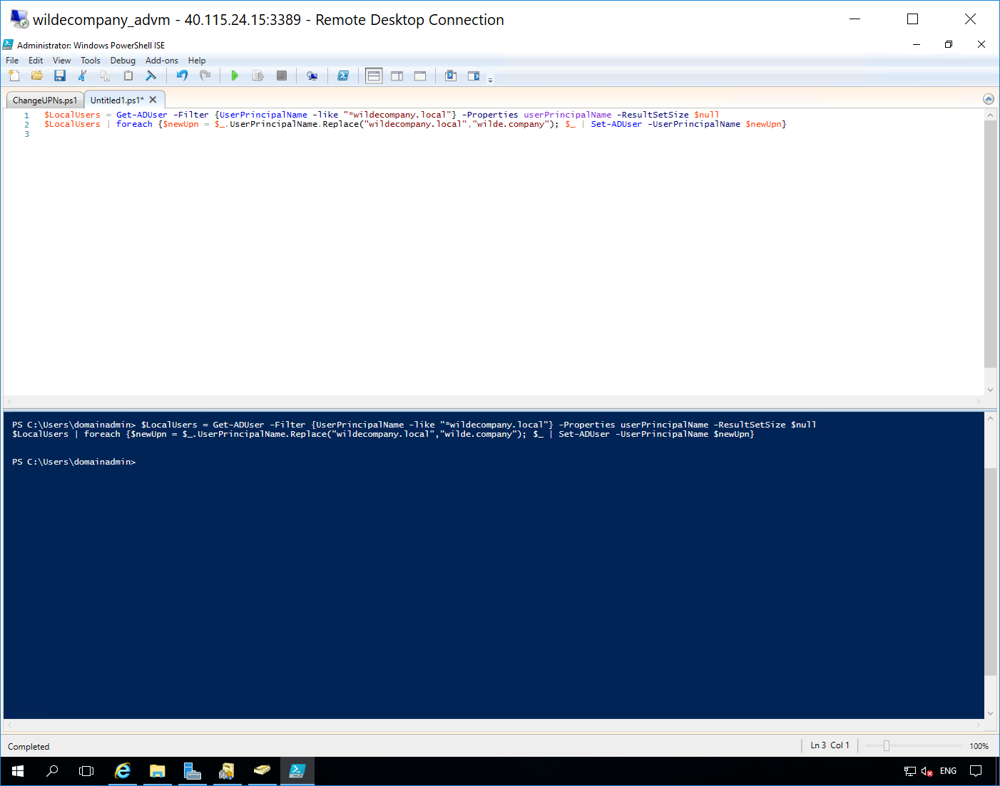
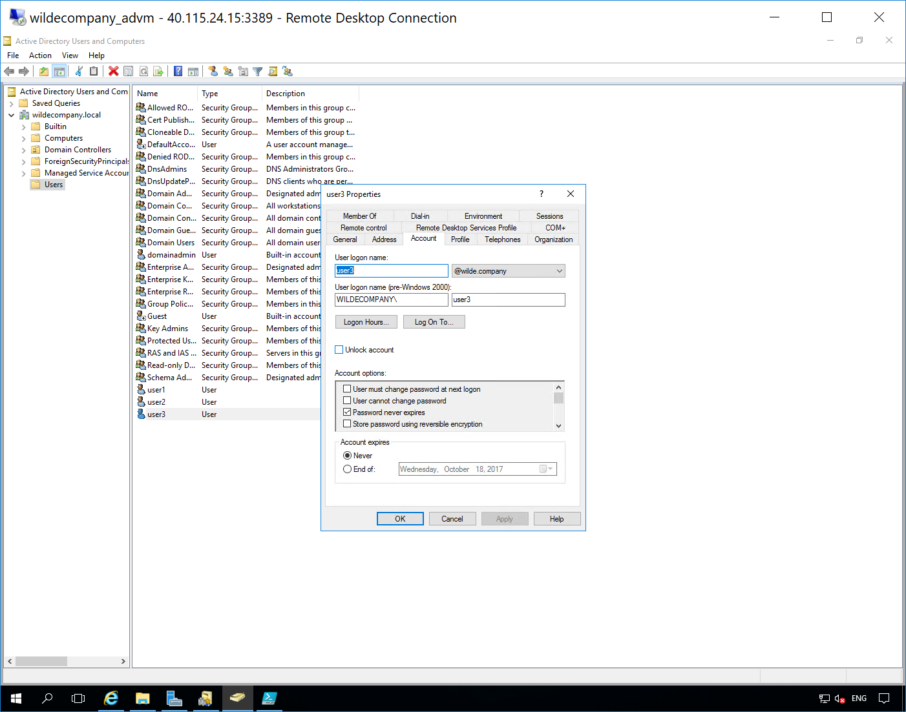

Extending Identities to the Cloud.



## Prepare Windows Active Directory
Now we need to configure our on premise domain to match the newly created and verified domain (if you own it) and configure our on premise identities to match. 
I will edit my on premise domain **wildecompany.local** then my users so they no longer log in as **wildecompany.local**, instead now log into **wilde.company**.


1. Connect to Domain Controller as a domain administrator, from server manager **Tools > Active Directory Domains and Trusts >** right click on **Active Directory Domains and Trusts > Properties**



2. Enter your verified domain name > **Add**

*I have added wilde.company*



3. 	In Active Directory users and computers change the UPN suffix, open user **> Account >** Select newly added UPN suffix **> OK**

*Notice the original and new UPN suffix we've just created, I have changed my user1 from wildecomany.local to wilde.company.* 



4. 	Completing this task manually will work fine but let's try using a script to save time, run Windows PowerShell ISE as an administrator and paste in the following:

```$LocalUsers = Get-ADUser -Filter {UserPrincipalName -like "*originaluserprincipalname"} -Properties userPrincipalName -ResultSetSize $null
$LocalUsers | foreach {$newUpn = $_.UserPrincipalName.Replace("originaluserprincipalname","newuserprinciplname"); $_ | Set-ADUser -UserPrincipalName $newUpn}
```

*Replace all of originaluserprincipalname and newuserprincipalname and Run*

*Here are my settings:*
* *originaluserprincipalname = wildecompany.local*
* *newuserprincipalname = wilde.company*

```$LocalUsers = Get-ADUser -Filter {UserPrincipalName -like "*wildecompany.local"} -Properties userPrincipalName -ResultSetSize $null
$LocalUsers | foreach {$newUpn = $_.UserPrincipalName.Replace("wildecompany.local","wilde.company"); $_ | Set-ADUser -UserPrincipalName $newUpn}
```



5. 	Verify in Active Directory Users and Computers the script has worked by opening up another user > **Account**

*Notice my user3 logon name is user3@wilde.company*




My **@wildecompany.local** users are now **@wilde.company**. Now we have matched our on premise users to log our public domain they will have a consistent experience regardless of whether they're logging in to on premise or cloud apps. This is a fundamental step when migrating our identities to the cloud. 

Move onto the next [next lab.](./identityconfigureADC)


## Labs
* [Lab: **Create Windows Active Directory Domain**](./identitycreatead)
* [Lab: **Create Azure Active Directory Tenant**](./identitycreateAAD)
* [Lab: **Prepare Windows Active Directory**](./identityprepareAS)
* [Lab: **Configure AD Connect**](./identityconfigureADC)


