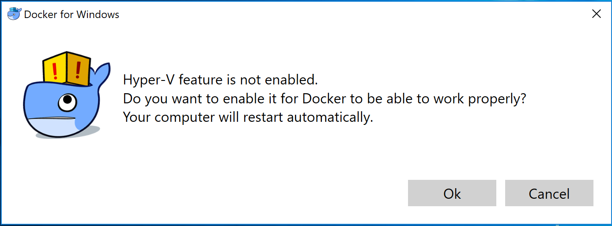

This simple guide runs through how to install and set up a working Docker environment on your local machine. Having Docker on your machine allows you to to work with containers, and carry our tasks such as:
* Running & testing containers
* Build your own images
* Use *Docker Compose* to create multi-container apps
* Push your images to container registry such as *Azure Container Registry*

Having Docker set up on your machine is a pre-req for many other guides and labs on this site. 

## Download & Install the Docker software

### Install Docker for Windows

* Navigate to the Docker download page [Docker for Windows](https://www.docker.com/docker-windows)
* Select **Download from Docker store**
* Click **Get Docker CE for Windows (stable)**
* When running the installer, accept all the defaults
  * You may be prompted to log out and back in. 
  * You may be prompted to enable Hyper-V  
    
  in which case, click **OK** and your system will reboot.

### Install Docker for Mac
* Navigate to the Docker download page [Docker for Mac](https://www.docker.com/docker-mac)
* Select **Download from Docker store**
* Select **Get Docker**

## Verify the Installation
* You should have a Docker "whale" icon in the systray and see a popup saying “Docker is running”.
* Open a PowerShell terminal window and run `docker info`

## Configuration Tips

You might want to stop Docker auto-starting on your workstation at boot:
* Right-click on *whale* icon 
* Select **Settings > General**
* Untick **Start Docker when you log in**

## Use with Windows Subsystem For Linux (WSL)
By default you will be able to run Docker commands such as `docker`, `docker-compose` and `docker-machine` from Windows PowerShell.  
However If you are using WSL bash as your main terminal rather than PowerShell there are some extra steps before you can connect

### 1. Install the Docker client tools
You only need the client tools installed **not the full Docker engine**. Do not try to install *Docker CE* (e.g. by running `apt install docker-ce`) as this will try to install the Docker engine in WSL and this will fail

You can install the client tools this by running the following command snippet in WSL bash. It's safe to copy and paste/run the whole snippet
```
curl -L https://download.docker.com/linux/static/stable/x86_64/docker-17.12.1-ce.tgz -o /tmp/docker.tgz
tar -zxvf /tmp/docker.tgz docker/docker
chmod +x docker/docker
sudo mv docker/docker /usr/local/bin/docker
rmdir docker/

curl -L https://github.com/docker/machine/releases/download/v0.14.0/docker-machine-`uname -s`-`uname -m` -o /tmp/docker-machine
chmod +x /tmp/docker-machine
sudo cp /tmp/docker-machine /usr/local/bin/docker-machine

curl -L https://github.com/docker/compose/releases/download/1.20.1/docker-compose-`uname -s`-`uname -m` -o /tmp/docker-compose
chmod +x /tmp/docker-compose
sudo cp /tmp/docker-compose /usr/local/bin/docker-compose

```

### 2. Enable Network Access 
Set the `DOCKER_HOST` environmental variable as follows `export DOCKER_HOST=tcp://0.0.0.0:2375` to point the Docker tools at your local install of Docker.

Without this set you will see the following error:  
*Cannot connect to the Docker daemon at unix:///var/run/docker.sock. Is the docker daemon running?*  

It is recommended to put the export command in your `~/.bashrc` to save you running it every time you open a bash shell

Now allow access to the Docker engine
* Right-click on *whale* icon 
* Select **Settings > General**
* Tick **Expose daemon on tcp://localhost:2375 without TLS**