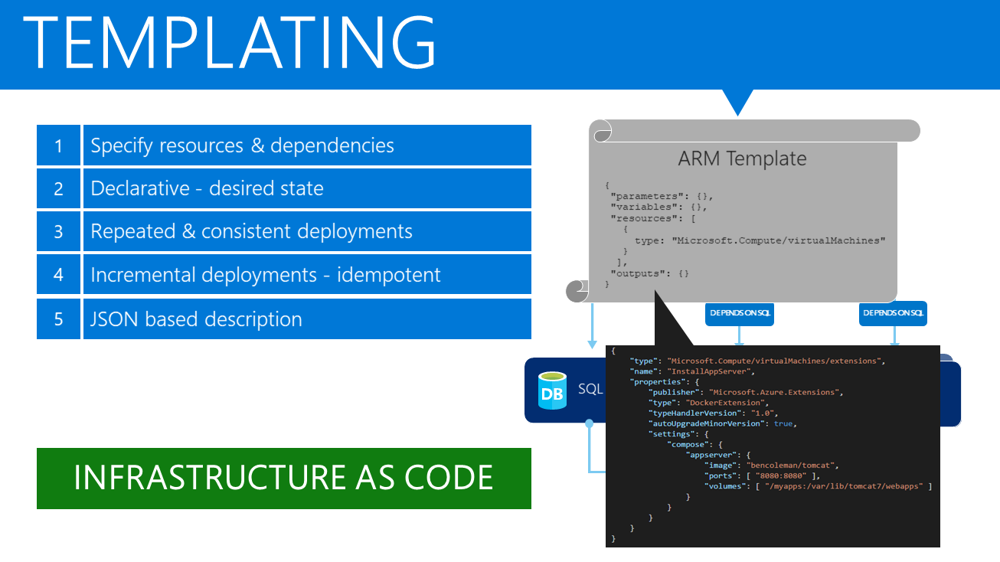
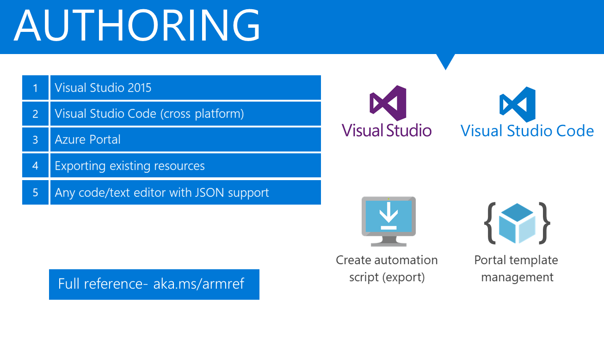



## Azure Resource Manager templates

Azure Resource Manager (ARM) templates are used to deploy resources into resource groups programatically.  ARM provides full Infrastructure as Code capability for Azure.

 

The format is very flexible and enables the configuration of multiple resources and the dependencies between them.

The form of the templates is **declaritive**, i.e. it *describes* the desired state of the resources to be added into the resource group. This is fundamentally different to the **imperative** form of PowerShell or Bash scripts, that tell the ARM layer exactly what to do.  With the declarative form the ARM layer will interpret the template and the current configuration of resources within the resource group and will then make the required additions or modifications.

The declarative form is a safer approach, and may be used repeatedly to provide consistent deployments.

**Idempotency** is another term used with ARM templates.  As a property, it means that subsequent deployments of the same template using the same parameters will always result in the same configuration. It is common to iteratively change one of the resources in a template and redeploy, safe in the knowledge that the other resources will be unaffected.  

> Note that the default deployment mode is **incremental**.  With this mode the deployment will not affect resources in that resource group that are not described in the template.  WIth this mode it is safe to submit multiple templates into the same resource group.  The other mode is **complete** and will remove any resources that are not described in the template, and therefore this mode should be used with caution.

## Azure Resource Manager JSON template format

The ARM template format is JSON format. 

Note that the curly brace objects in JSON contain key:value pairs.  The value in the key:value pair can also be another object.  

Square brackets are another object type, and contain lists of unnamed (but indexed) objects.

Here is an empty template to show the structure.

```json
{
  "$schema": "http://schema.management.azure.com/schemas/2015-01-01/deploymentTemplate.json#",
  "contentVersion": "1.0.0.0",
  "parameters": {
  },
  "variables": {
  },
  "resources": [
    {
    }
  ],
  "outputs": {  }
}
```

**Section** | Description
**schema** | JSON schema that describes the template format
**contentVersion** | version of the schema 
**parameters** | user (or script) inputs to the template
**variables** | used within the template to simplify the resources later
**resources** | list of resources to deploy
**outputs** | optional output JSON information

Of these, the schema and contentVersion are mandatory, as are the resources.  Parameters and variables are almost always included. Outputs are rarer, and only really used when nesting templates.  More on that later.

> The ARM templates may be given any name, but the common convention is to name the template file **azuredeploy.json**.

## Parameters Files

Most ARM templates include user parameters. It is possible to specify parameters inline when deploying (and we'll come to that later), but most deployments use a parameters file.  

This is another JSON format file, following a simple schema:

```json
{
  "$schema": "http://schema.management.azure.com/schemas/2015-01-01/deploymentParameters.json#",
  "contentVersion": "1.0.0.0",
  "parameters": {
    "name": {
      "value": "myResourceName"
    },
    "sku": {
      "value": "Standard"
    }
  }
}
```

The "name" and "sku" are illustrative parameters.  The actuak paraneters would depend on the ARM template.

> By convention the parameters file is usually named **azuredeploy.parameters.json**.

## Authoring ARM templates

If you go through the following lab sections then you will create example template and parameter files.  By doing so you will also be exposed to some of the key functions that are often used.

 

The truth is that you can use any text editor to manipulate JSON files, but most power users will prefer those with support for JSON formatting and snippets of code.  Atom is a good example.

Microsoft provide a couple of integrated development environments (IDEs) that are receommended.  The more heavyweight product is Visual Studio 2017, with good integration with Azure.  Adding resources into a JSON file adds in variables and parameters as well, and it has strong intellisense so it is a good option.  However for many it is a sledgehammer to crack a nut, and can be complex and slow.

The more lightweight cross platform product is Visual Studio Code.  This supports syntax highlighting, intellisense and snippets.  and through the extensions is has some 

## Recommended reading

For more background information on JSON templates and how they are deployed using into Azure Resource Manager, start with the following links:


* [Template Sections](https://docs.microsoft.com/en-us/azure/azure-resource-manager/resource-group-authoring-templates)